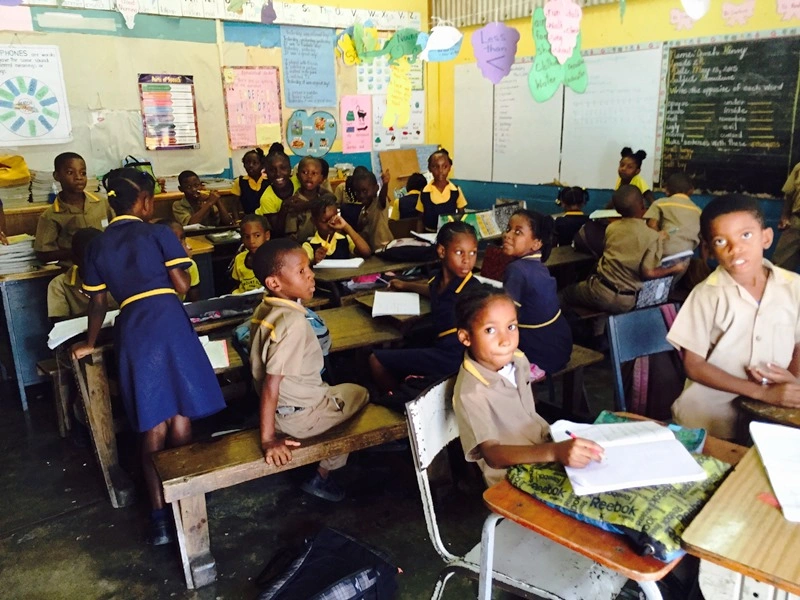

```{=html}
<style>                     
.navbar {
  background-color:#B23AEE;
  border-color:white;
}
.navbar-brand {
color:white!important;
}
</style>
```
```{r setup, include=FALSE}
library(flexdashboard)
```

```{r include=FALSE}
library(rio)
library(ggplot2)
library(DT)
library(kableExtra)
library(modelsummary)
```

```{r include=FALSE}
data = import("data_final.xlsx")
mapMUN=sf::read_sf("World_Countries_Generalized.shp")
```

```{r}
mapMUN2=merge(mapMUN,data,by = "ISO", all.x = T)
```

```{r}
colnames(data)[colnames(data) == "gasto edu"] <- "gedu"
```

```{r}
library(dplyr)
a = data %>% group_by(region) %>% summarize(promedio = mean(ic, na.rm = T))
a$promedio = round(a$promedio, 0)

b = data %>% group_by(region) %>% summarize(promedio2 = mean(perseve, na.rm = T))
b$promedio2 = round(b$promedio2, 0)

c = data %>% group_by(region) %>% summarize(promedio3 = mean(gedu, na.rm = T))
b$promedio3 = round(c$promedio3, 0)

d = data %>% group_by(region) %>% summarize(promedio4 = mean(Ninguna, na.rm = T))
b$promedio4 = round(d$promedio4, 0)
```

# Presentación

## Column {data-width="500"}

### **Tema de investigación**


**Relación entre educación y seguridad ciudadana**


Enfatizamos la necesidad de la inversión estatal para proporcionar ambientes y recursos adecuados que permitan a los niños y adolescentes completar sus estudios. Analizamos como la falta de apoyo estatal conduce al abandono escolar y, consecuentemente, expone a los niños y adolescentes a la participación en actividades delictivas, exacerbando la inseguridad.


En el trabajo, vemos la educación como un mecanismo preventivo, enfatizando su papel en el desarrollo de habilidades para una convivencia productiva y segura en la sociedad. Se respaldará la argumentación con ejemplos, como la situación en América Latina, donde sistemas educativos deficientes se asocian con altos índices de criminalidad. La presentación buscará generar conciencia sobre la importancia de abordar este problema.

### 



## Column {data-width="500"}

###

**Variable dependiente**

[Indice de criminalidad]{.underline}

**Tipo de variable:** numérica continua acotado

Utiliza una escala de 0 a 100 para facilitar la lectura de los valores; esta considera los niveles de criminalidad menores de 20 como "Muy Bajos", niveles entre 20 a 40 como "Bajos", entre 40 a 60 como "moderados", 60 a 80 como "altos" y los niveles de 80 como "Muy Altos".

Fuente: [Numbeo](https://es.numbeo.com/criminalidad/clasificaciones-por-pa%C3%ADs?title=2020)

**Variables independientes**

-   Perseverancia hasta el último año del nivel primaria

**Tipo de variable:** numérica continua acotado

Corresponde a la proporción de estudiantes matriculados en el primer grado de educación primaria que eventualmente llegan al último grado dicho nivel, utilizando datos de matrícula y repitentes de dos años consecutivos.

-   Gasto en educación (Porcentaje PBI)

**Tipo de variable:** numérica continua acotada

Comprende el gasto público total (corriente y de capital) en educación expresado como porcentaje del Producto Interno Bruto (PIB) en un año determinado.

Fuente: [BM](https://datos.bancomundial.org/indicator/SE.XPD.TOTL.GD.ZS)

-   Data de porcentaje de niños ocupados en una actividad económica

**Tipo de variable:** numérica continua acotada

Corresponde a las estimaciones sobre la actividad económica durante una semana entre los niños de 5 a 17 años.

Fuente: [ILOSTAT](https://www.ilo.org/shinyapps/bulkexplorer23/?lang=es&id=SDG_A871_SEX_AGE_RT_A)

# Indice de criminalidad

## Column {data-width="500"}

### Mapa

```{r}
library(ggplot2)
library(dplyr)
mapaleyenda= ggplot(mapMUN2)+ geom_sf() + theme_light()

mapaley= mapaleyenda + geom_sf(data=mapMUN2,
              aes(fill=`ic`),color = "transparent")
      
mapa1= mapaley +
coord_sf() + 
scale_fill_gradient(low = "#FCFBFF",  high = "#3D1778",breaks=seq(from=0, to=100, by=20)) + theme_void() + 
  
theme(axis.title = element_blank(), axis.text = element_blank(), legend.position = "bottom") + labs(fill=" ") + theme(legend.text = element_text(size = 8)) +
  
labs(title = "Indice de criminalidad en el mundo",
     subtitle = "Escala del 0 al 100",
    caption = "Fuente: NUMBEO 2018") +
  
theme(
plot.title = element_text(color="black", size=10, face="bold"))


library(plotly)
ggplotly(mapa1)
```

## Column {data-width=500} {.tabset}

### índice de criminalidad regional

```{r}
library(ggplot2)
ggplot(a, aes(x=region, y=promedio)) +
geom_bar(stat = "identity", lwd=2, fill= "#FFBBFF") + coord_flip()+
  
labs(title = "Indice de criminalidad",
x = " ",
y = "0 - 80")+
geom_text(aes(label=promedio),color="#68228B", size=5, vjust=0.5)+ theme_bw()+
ylim(c(0,80))
```

### Tabla índices

```{r include=FALSE}
cuadro = data[,c(1,5)]
```

```{r}
colnames(cuadro)[2] = "Indice de criminalidad"
datatable(cuadro, filter = "top")
```

```{r}
modelo1=formula(ic~poblacion+perseve)
modelo2=formula(ic~poblacion+perseve+gedu)
modelo3=formula(ic~poblacion+perseve+gedu+Ninguna)
```

```{r}
reg1=lm(modelo1,data=data)
reg2=lm(modelo2,data=data)
reg3=lm(modelo3,data=data)
```

# Modelando el índice

## Column {data-width=400} {.tabset}

### OLS

```{r}
library(modelsummary)
models=list('Regresion (I)'=reg1,
            'Regresion (II)'=reg2,
            'Regresion (III)'=reg3)
modelsummary(models, title = "Resultados de todos los modelos",
             stars = TRUE,
             output = "kableExtra")
```

```{r}
dontselect=c("Country Code","ic","poblacion", "ISO", "region")
select=setdiff(names(data),dontselect) 
theData=data[,select]
```

```{r}
library(polycor)
corMatrix=polycor::hetcor(theData)$correlations
```

## Column {data-width="500"}

### OLS

```{r}
library(ggcorrplot)
ggcorrplot(corMatrix, colors = c("#DC5FBD", "white", "#7B66D2"), lab=TRUE)
```

```{r}
library(dplyr)

datos_ordenados <- data %>%
  select(region, ISO, poblacion, perseve, gedu, Ninguna, ic)
```

```{r}
dataClus=datos_ordenados[,c(4:6)]
row.names(dataClus)=datos_ordenados$ISO
```

```{r}
library(cluster)
g.dist = daisy(dataClus, metric="gower")
```

```{r include=FALSE}
library(factoextra)
fviz_nbclust(dataClus, hcut,diss=g.dist,method = "gap_stat",k.max = 10,verbose = F,hc_func = "diana")
```

```{r include=FALSE}
library(factoextra)
set.seed(123)
res.diana <- hcut(g.dist, k = 3,hc_func='diana')
dataClus$diana=res.diana$cluster
```

```{r include=FALSE}
silDIANA=data.frame(res.diana$silinfo$widths)
silDIANA$country=row.names(silDIANA)
poorDIANA=silDIANA[silDIANA$sil_width<0,'country']%>%sort()
```

```{r include=FALSE}
datos_ordenados$dianaICpoor=datos_ordenados$ISO%in%poorDIANA
datos_ordenados$dianaIC=as.ordered(dataClus$diana)
dataClus$diana=NULL
datos_ordenados$dianaIC=as.factor(datos_ordenados$dianaIC)
```

```{r}
mapMUN3=merge(mapMUN,datos_ordenados,by = "ISO", all.x = T)
```

# Correlación y agrupación

## Column {data-width=500} {.tabset}

### IC y Perverancia

```{r}
library(ggplot2)
graf3<- ggplot(data, aes(x=ic, y=perseve, color = "#B23AEE")) + geom_point() +
  geom_point(size=3, shape=20) +
  geom_text(label=data$`ISO`, vjust=-0.5, hjust = 1,color="black", size=3) +
  
  
    labs(title = "Indice de criminalidad y perseverancia en culminar sus estudios",
       subtitle = "Correlación entre ic y perseve",
       x = "Índice de criminalidad",
       y = "Perseverancia") +
  
   scale_color_manual(values=c("#B23AEE",'Red')) +
 theme(legend.position = "none")+
  ylim(25,120)
  plot(graf3, fill = data, col_pal = muted, title = "") %>% 
  plotly::ggplotly()
```

### IC y gasto en educacion

```{r}
graf2 <- ggplot(data, aes(x=ic, y=gedu, color = "#B23AEE")) + geom_point() +
  geom_point(size=3, shape=20) +
  geom_text(label=data$`ISO`, vjust=-0.5, hjust = 1,color="black", size=3) +
  
  
    labs(title = "Indice de criminalidad y el gasto en educación",
       subtitle = "Correlación entre ic y gedu",
       x = "Índice de criminalidad",
       y = "Gasto en educación") +
  
   scale_color_manual(values=c("#B23AEE",'Red')) +
 theme(legend.position = "none")+
  ylim(0,30)

  plot(graf2, fill = data, col_pal = muted, title = "") %>% 
  plotly::ggplotly()
```

### IC y no estudia

```{r}
library(ggplotlyExtra)
graf1 <- ggplot(data, aes(x=ic, y=Ninguna, color = "#B23AEE")) + geom_point() +
  geom_point(size=3, shape=20) +
  geom_text(label=data$`ISO`, vjust=-0.5, hjust = 1,color="black", size=3) +
  
  
    labs(title = "Indice de criminalidad y grupo de niños que no estudian",
       subtitle = "Correlación entre ic y ninguna",
       x = "Índice de criminalidad",
       y = "No ocupa, no estudia") +
  
   scale_color_manual(values=c("#B23AEE",'Red')) +
 theme(legend.position = "none")+
  ylim(0,70)

  plot(graf1, fill = data, col_pal = muted, title = "") %>% 
  plotly::ggplotly()
```

## Column {data-width=500} {.tabset}

### Conglomeración mundial

```{r}
mapaley3 <- ggplot(mapMUN3) + 
  geom_sf(aes(fill = dianaIC), color = "#DCDCDC") +
  scale_fill_manual(values = c("#FF6AD5", "#94D0FF", "#AD8CFF"), labels = na.omit(c("Grupo 1", "Grupo 2", "Grupo 3"))) +
  labs(fill = "Grupos de Conglomerados",
       title = "Conglomerados",
       subtitle = "separados en 3 grupos",
       caption = "Fuente: Diana") +
  theme(
    axis.title = element_blank(), 
    axis.text = element_blank(), 
    legend.position = "bottom",
    plot.title = element_text(color = "black", size = 10, face = "bold"),
    plot.margin = margin(b=2),
    legend.text = element_text(size = 8)) +
  coord_sf()

# Mostrar el gráfico
mapaley3
```

### Silueta de conglomeración

```{r}
library(factoextra)
fviz_silhouette(res.diana,print.summary = F)
```
